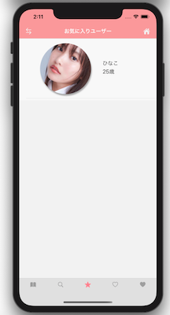
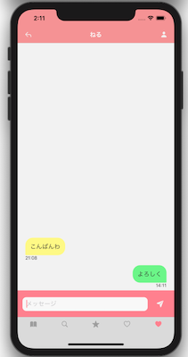

# SUTADEITO
 
 
 
  
 
  
 
# Features
 
SwiftUIを使って、勉強に特化したマッチングアプリを制作しました。
 
# Requirement
 
* Swift 5
* Xcode 11.5
* FirebaseAuth 6.7.0
* FirebaseFirestore 1.16.2
* FirebaseStorage 3.8.0
 
# Installation
 
CocoaPodsが必要です。  
インストールの上、ディレクトリを移動し下記コマンドを実行してライブラリをインストールしてください。
 
```bash
pod install
```
 
# Usage
 
デモアカウント  
 email:  aaa@aaa.com  
 pass: 1234aaa
